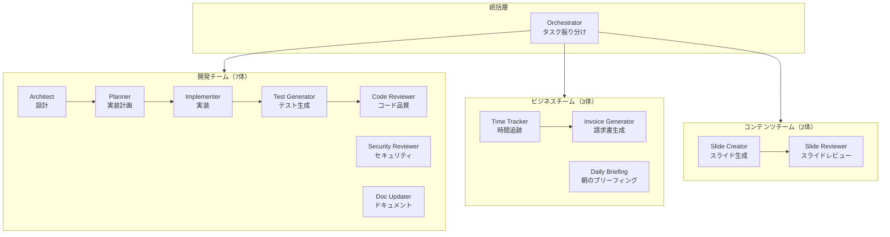

# エージェント体制図

## 概要

mugu-orchestrationはハイブリッド型エージェント組織を採用。統括層（Orchestrator）の下に、機能別チームを配置しています。

**現在のエージェント数: 13体**

---

## 体制図（Mermaid）



---

## ディレクトリ構成

```
agents/
├── orchestrator.md              # 統括エージェント
│
├── development/                 # 開発チーム（7体）
│   ├── architect.md            # 設計・技術選定
│   ├── planner.md              # 実装計画
│   ├── implementer.md          # コード実装
│   ├── test-generator.md       # テスト生成
│   ├── code-reviewer.md        # コード品質レビュー
│   ├── security-reviewer.md    # セキュリティレビュー
│   └── doc-updater.md          # ドキュメント更新
│
├── business/                    # ビジネスチーム（3体）
│   ├── time-tracker.md         # 時間追跡
│   ├── invoice-generator.md    # 請求書生成
│   └── daily-briefing.md       # デイリーブリーフィング
│
└── content/                     # コンテンツチーム（2体）
    ├── slide-creator.md        # スライド生成
    └── slide-reviewer.md       # スライドレビュー
```

---

## チーム別エージェント一覧

### 統括層（1体）

| エージェント | 役割 | モデル |
|-------------|------|--------|
| **Orchestrator** | タスク振り分け、チーム間調整 | Sonnet |

### 開発チーム（7体）

| エージェント | 役割 | モデル | コマンド |
|-------------|------|--------|---------|
| **Architect** | 設計・技術選定 | Opus | `/architect` |
| **Planner** | 実装計画・タスク分解 | Opus | `/plan` |
| **Implementer** | コード実装 | Opus | `/implement` |
| **Test Generator** | テスト提案・生成 | Sonnet | `/test-gen` |
| **Code Reviewer** | コード品質レビュー | Sonnet | `/code-review` |
| **Security Reviewer** | セキュリティ分析 | Opus | - |
| **Doc Updater** | ドキュメント更新 | Sonnet | - |

### ビジネスチーム（3体）

| エージェント | 役割 | プラットフォーム | コマンド |
|-------------|------|-----------------|---------|
| **Time Tracker** | 作業時間記録 | Slack Bot | `/in`, `/out`, `/status` |
| **Invoice Generator** | 請求書生成（サブ） | - | `/invoice` |
| **Daily Briefing** | 朝の情報まとめ | Slack Bot | `/briefing` |

### コンテンツチーム（2体）

| エージェント | 役割 | モデル | コマンド |
|-------------|------|--------|---------|
| **Slide Creator** | Marpスライド生成 | Sonnet | `/slide` |
| **Slide Reviewer** | スライドレビュー（サブ） | Sonnet | `/slide-review` |

---

## 開発フロー

```
設計依頼
    │
    ▼
Architect（設計・技術選定）
    │
    ▼
Planner（実装計画・タスク分解）
    │
    ▼
Implementer（コード実装）
    │
    ▼
Test Generator（テスト提案・生成）
    │
    ▼
Code Reviewer（コード品質レビュー）
    │
    ├──→ Security Reviewer（セキュリティ懸念がある場合）
    │
    ▼
Doc Updater（ドキュメント更新）
    │
    ▼
完了
```

---

## 親子関係

```
Time Tracker
    └── Invoice Generator（サブエージェント）

Slide Creator
    └── Slide Reviewer（サブエージェント）
```

---

## 拡張予定

詳細は [agent-roadmap.md](./agent-roadmap.md) を参照。

### Phase 2: ビジネス強化（+3体 → 16体）
- Meeting Summarizer（議事録）
- Email Drafter（メール下書き）
- Task Prioritizer（タスク優先順位）

### Phase 3: コンテンツ強化（+3体 → 19体）
- Blog Writer（ブログ）
- SNS Manager（SNS管理）
- Video Script Writer（動画台本）

### Phase 4: リサーチチーム新設（+4体 → 23体）
- Tech Researcher（技術調査）
- Competitor Analyst（競合分析）
- Trend Watcher（トレンド監視）
- Paper Reader（論文読解）

---

## 関連ドキュメント

- [エージェント強化ガイド](./agent-enhancement-guide.md) - カスタマイズ方法
- [拡張ロードマップ](./agent-roadmap.md) - 将来の拡張計画
- [Lessons Learned](./lessons.md) - 学習記録
