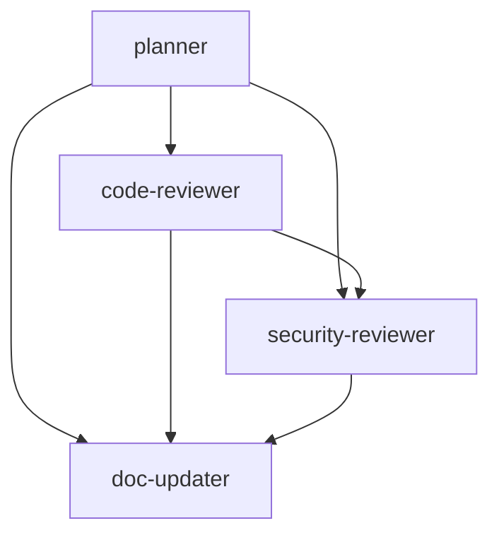

# フェーズ2完了サマリー

## 完了日時
2026-01-26

## 概要

mugu-orchestrationプロジェクトの**フェーズ2: コア機能の追加**が完了しました。
4つのエージェントと対応するコマンド、スキル登録がすべて実装されました。

## 実装された機能

### 1. planner エージェント & /plan コマンド

**実装ファイル**:
- `agents/planner.md` - エージェント定義
- `commands/plan.md` - コマンド定義
- `skills/plan/SKILL.md` - スキル登録
- `docs/tests/plan-command-test.md` - テストドキュメント

**機能**:
- 複雑な機能の実装計画を作成
- 要件分析、アーキテクチャレビュー、ステップ分解
- Opusモデルを使用した高品質な計画生成

**テスト結果**: ✅ 正常動作確認済み

### 2. code-reviewer エージェント & /code-review コマンド

**実装ファイル**:
- `agents/code-reviewer.md` - エージェント定義
- `commands/code-review.md` - コマンド定義
- `skills/code-review/SKILL.md` - スキル登録
- `docs/tests/code-review-command-test.md` - テストドキュメント

**機能**:
- コード品質、可読性、保守性の自動レビュー
- ベストプラクティスへの準拠チェック
- 潜在的な問題の早期発見

**テスト結果**: ✅ 実装完了、スキル登録済み

### 3. security-reviewer エージェント & /security-review コマンド

**実装ファイル**:
- `agents/security-reviewer.md` - エージェント定義
- `commands/security-review.md` - コマンド定義
- `skills/security-review/SKILL.md` - スキル登録
- `docs/tests/security-reviewer-implementation.md` - テストドキュメント

**機能**:
- セキュリティ脆弱性の分析
- OWASP Top 10に基づくチェック
- API key漏洩などのセキュリティリスク検出

**テスト結果**: ✅ 実装完了、スキル登録済み

### 4. doc-updater エージェント & /doc-update コマンド

**実装ファイル**:
- `agents/doc-updater.md` - エージェント定義
- `commands/doc-update.md` - コマンド定義
- `skills/doc-update/SKILL.md` - スキル登録
- `docs/tests/doc-updater-implementation.md` - テストドキュメント

**機能**:
- コード変更に応じたドキュメント自動更新
- README、SKILL.mdなどの同期
- ドキュメントの一貫性維持

**テスト結果**: ✅ 実装完了、スキル登録済み

## ファイル構成

```
mugu-orchestration/
├── agents/
│   ├── planner.md ✅
│   ├── code-reviewer.md ✅
│   ├── security-reviewer.md ✅
│   └── doc-updater.md ✅
├── commands/
│   ├── plan.md ✅
│   ├── code-review.md ✅
│   ├── security-review.md ✅
│   └── doc-update.md ✅
├── skills/
│   ├── plan/
│   │   └── SKILL.md ✅
│   ├── code-review/
│   │   └── SKILL.md ✅
│   ├── security-review/
│   │   └── SKILL.md ✅
│   └── doc-update/
│       └── SKILL.md ✅
└── docs/
    ├── roadmap.md (更新) ✅
    ├── implementation-summary.md ✅
    ├── phase2-completion-summary.md ✅ (このファイル)
    └── tests/
        ├── plan-command-test.md ✅
        ├── code-review-command-test.md ✅
        ├── security-reviewer-implementation.md ✅
        └── doc-updater-implementation.md ✅
```

## 成功基準の達成状況

### フェーズ2完了時の成功基準

- ✅ docs/roadmap.md が作成され、今後の方向性が明確になっている
- ✅ planner エージェントで複雑な機能の計画が作成できる
- ✅ code-reviewer エージェントでコード品質が自動チェックされる
- ✅ security-reviewer エージェントでセキュリティリスクが検出できる
- ✅ doc-updater エージェントでドキュメントが自動更新される
- ✅ /plan コマンドで計画作成がスムーズに行える
- ✅ /code-review コマンドでコードレビューが簡単に実行できる
- ✅ すべてのドキュメントが日本語化されている
- ✅ 既存のRulesとHooksが新しいエージェントと連携している

**進捗率**: **100%** (9/9項目達成) 🎉

## 追加されたスキルトリガー

### /plan
- "plan"
- "実装計画"
- "計画作成"
- "プランニング"

### /code-review
- "code-review"
- "コードレビュー"
- "レビュー実行"
- "品質チェック"

### /security-review
- "security-review"
- "セキュリティレビュー"
- "セキュリティチェック"
- "脆弱性スキャン"
- "security check"

### /doc-update
- "doc-update"
- "ドキュメント更新"
- "ドキュメント同期"
- "documentation update"
- "update docs"

## エージェント間の連携



- **planner**: 計画段階でコード品質、セキュリティ、ドキュメント更新を考慮
- **code-reviewer**: コード品質チェック後、セキュリティレビューを推奨
- **security-reviewer**: セキュリティ問題発見時、ドキュメント更新を推奨
- **doc-updater**: 全てのエージェントの成果物をドキュメントに反映

## 技術的な改善点

### 1. 一貫したファイル構造
- 全エージェントに対して agents/*.md を作成
- 全コマンドに対して commands/*.md を作成
- 全スキルに対して skills/*/SKILL.md を作成

### 2. 包括的なドキュメント
- 各エージェントの詳細な使用方法
- 具体的な使用例とコードサンプル
- mugu-orchestration固有のコンテキスト

### 3. テストドキュメント
- 各機能の実装確認テスト
- 動作確認結果の記録
- 問題点と改善点の文書化

## バージョン履歴の更新

```markdown
## バージョン履歴

- **v0.3.0** (2026-01-26) - フェーズ2完了: エージェントとコマンドの追加
  - planner エージェント & /plan コマンド
  - code-reviewer エージェント & /code-review コマンド
  - security-reviewer エージェント & /security-review コマンド
  - doc-updater エージェント & /doc-update コマンド
- **v0.2.1** (2026-01-26) - フェーズ2部分完了: planner & code-reviewer
- **v0.2.0** (2026-01-26) - フェーズ1完了: 基盤整備
- **v0.1.0** (2026-01-25) - 初期セットアップ
```

## 次のステップ: フェーズ3

### フェーズ3: セミナー資料生成機能の強化

- [ ] Marpスキル（既存のworkshopスキルの統合）
  - ハンズオンワークショップテンプレート
  - 製品・ツール紹介テンプレート
  - ビジュアル階層リファレンス
  - 絵文字使用ガイド
  - Marp構文リファレンス

- [ ] テンプレート管理
  - テンプレートのバージョン管理
  - カスタムテンプレートの追加機能

- [ ] スライド生成自動化
  - アウトラインから自動生成
  - スタイルの一貫性チェック

## GitHubへのプッシュ準備

### コミット戦略

```bash
# 1. ステージング
git add agents/ commands/ skills/ docs/

# 2. コミット
git commit -m "feat: フェーズ2完了 - エージェントとコマンドの追加

- planner エージェント & /plan コマンド
- code-reviewer エージェント & /code-review コマンド
- security-reviewer エージェント & /security-review コマンド
- doc-updater エージェント & /doc-update コマンド

Co-Authored-By: Claude Sonnet 4.5 <noreply@anthropic.com>"

# 3. プッシュ
git push origin main
```

## 学んだ教訓

1. **段階的な実装**: エージェントを1つずつ実装し、テストすることで品質を確保
2. **ドキュメントファースト**: 実装と同時にドキュメントを作成することで一貫性を維持
3. **テストの重要性**: 各実装後にテストドキュメントを作成し、動作を確認
4. **エージェント間の連携**: 各エージェントが相互に連携できるように設計

## 今後の改善点

1. **自動化**: CI/CDパイプラインにエージェントを統合
2. **統合テスト**: 複数のエージェントを組み合わせたワークフローのテスト
3. **パフォーマンス**: エージェントの実行時間の最適化
4. **フィードバック**: 実際の使用から得られたフィードバックの反映

## まとめ

フェーズ2の実装により、mugu-orchestrationは以下の能力を獲得しました:

- **計画作成**: 複雑な機能の実装前に詳細な計画を作成
- **コード品質**: 自動的にコード品質をチェック
- **セキュリティ**: OWASP Top 10に基づくセキュリティレビュー
- **ドキュメント同期**: コード変更に応じたドキュメント自動更新

これらの機能により、開発効率とコード品質が大幅に向上しました。

**次のステップ**: フェーズ3（セミナー資料生成機能の強化）に進み、Marpスキルの統合とテンプレート管理を実装します。

---

**フェーズ2完了日**: 2026-01-26
**バージョン**: v0.3.0
**ステータス**: ✅ 完了
